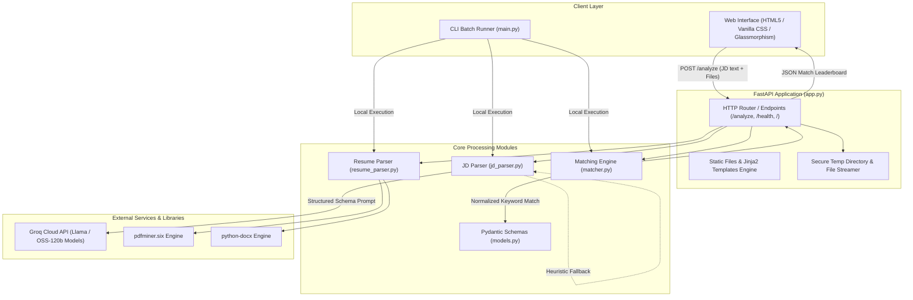
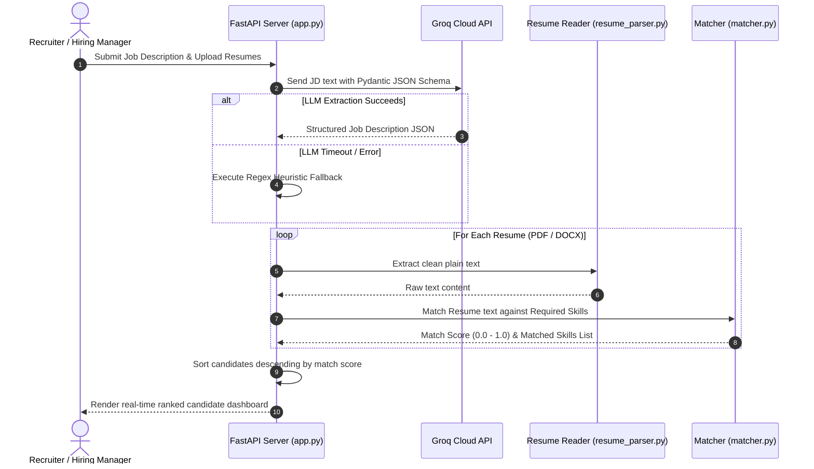

# ResumeAI ⚡ — AI-Powered Resume Parser & Candidate Matcher

[](https://www.python.org/)
[](https://fastapi.tiangolo.com/)
[](https://groq.com/)
[](https://ai-resume-parser-s1jf.onrender.com/)
[](LICENSE)

An intelligent, production-ready resume screening and applicant matching engine. **ResumeAI** extracts structured requirements from arbitrary job descriptions using ultra-fast LLMs on Groq, parses multi-format resumes (PDF, DOCX), performs robust token-level skill matching, and ranks applicants with an interactive, modern web interface.

🌐 **Live Demo:** [https://ai-resume-parser-s1jf.onrender.com](https://ai-resume-parser-s1jf.onrender.com)

---

## 📌 Table of Contents

- [Overview](#-overview)
- [System Architecture](#-system-architecture)
- [Data Flow Pipeline](#-data-flow-pipeline)
- [Key Features](#-key-features)
- [Matching Algorithm & Scoring](#-matching-algorithm--scoring)
- [Project Structure](#-project-structure)
- [Tech Stack](#-tech-stack)
- [API Reference](#-api-reference)
- [Getting Started](#-getting-started)
  - [Prerequisites](#prerequisites)
  - [Installation](#installation)
  - [Environment Configuration](#environment-configuration)
  - [Running the Web UI](#running-the-web-ui)
  - [Running the CLI Pipeline](#running-the-cli-pipeline)
- [Deployment Guide (Render)](#-deployment-guide-render)
- [Roadmap](#-roadmap)
- [Contributing & License](#-contributing--license)

---

## 🚀 Overview

Recruiters and hiring managers often spend countless hours manually parsing heterogeneous resumes against lengthy job descriptions. **ResumeAI** automates this pipeline with:

1. **Zero-shot JD Information Extraction**: Uses Groq LLM inference with strict Pydantic JSON schema constraints to extract roles, required skills, preferred competencies, experience benchmarks, and responsibilities.
2. **Deterministic Document Parsing**: Robust text extraction from `.pdf` (via `pdfminer.six`) and `.docx` (via `python-docx`) without the latency and failure modes of heavy OCR tools.
3. **Resilient Token Matching**: Normalized keyword extraction and stop-word filtering to avoid false negatives caused by formatting differences or phrasal variations.
4. **Instant Candidate Ranking**: Generates an ordered leaderboard with match percentages, verified skill breakdowns, and missing requirements.

---

## 🏗️ System Architecture



---

## 🔄 Data Flow Pipeline



---

## ✨ Key Features

- **⚡ Sub-Second LLM Extraction**: Powered by Groq's LPU™ inference engine for near-instant job description analysis.
- **🛡️ Strict Schema Validation**: Enforces structured Pydantic data types (`JobDescription`, `Resume`, `MatchResult`) to ensure clean downstream processing.
- **🔄 Fault-Tolerant Fallback**: Built-in regex and heuristic parser ensures analysis never halts, even under strict API rate limits or network degradation.
- **📄 Dual Document Support**: Seamlessly processes both modern `.pdf` and `.docx` formatted candidate submissions.
- **🎯 Smart Token-Level Matcher**: Strips English stopwords, punctuations, and qualifiers (`knowledge of`, `strong ability in`) to measure real semantic overlap.
- **🎨 Modern Dark Glassmorphism UI**: High-contrast, responsive dashboard with drag-and-drop file upload, real-time score indicators, and skill tags.
- **📦 Ready for Production**: Includes `render.yaml`, `Procfile`, and automated directory initialization for frictionless cloud deployment.

---

## 🧮 Matching Algorithm & Scoring

The scoring engine implements an optimized token-based containment strategy:

1. **Stop-Word Removal**: Strips common non-discriminative words:
   $$\mathcal{W}_{\text{stop}} = \{\text{"ability", "knowledge", "experience", "strong", "familiarity", "technologies", \dots}\}$$
2. **Tokenization**: Splits skill phrases into discriminative unigrams and bigrams:
   $$\text{Tokens}(S) = \{ t \in \text{split}(S) \mid \text{len}(t) \ge 2 \land t \notin \mathcal{W}_{\text{stop}} \}$$
3. **Skill Verification**: A required skill $S_i$ is validated as present if any discriminative token matches the normalized resume text $\mathcal{R}_{\text{norm}}$:
   $$\text{Matched}(S_i, \mathcal{R}_{\text{norm}}) = \begin{cases} 1 & \text{if } \exists t \in \text{Tokens}(S_i) : t \in \mathcal{R}_{\text{norm}} \\ 0 & \text{otherwise} \end{cases}$$
4. **Aggregate Match Score**:
   $$\text{Score} = \frac{\sum_{i=1}^{N} \text{Matched}(S_i, \mathcal{R}_{\text{norm}})}{N}$$
   *(where $N$ is the total count of required skills detected in the job description)*.

---

## 📁 Project Structure

```text
ai-resume-parser/
├── app.py                 # FastAPI web application, routes, and API endpoints
├── main.py                # Standalone CLI batch processing pipeline
├── jd_parser.py           # LLM-based Job Description parser with fallback
├── resume_parser.py       # Document extractors (PDF via pdfminer, DOCX via python-docx)
├── matcher.py             # Keyword tokenization and resume scoring logic
├── models.py              # Pydantic data schemas (JobDescription, Resume, MatchResult)
├── Procfile               # Process file for cloud web services (Render / Heroku)
├── render.yaml            # Render Infrastructure-as-Code deployment blueprint
├── requirements.txt       # Production dependencies
├── .env.example           # Example environment variable template
├── static/                # Static assets (CSS, JS, images)
│   └── .gitkeep
├── templates/             # Jinja2 HTML templates
│   └── index.html         # Single-page modern application interface
└── resumes/               # Optional directory for local CLI batch testing
```

---

## 🛠️ Tech Stack

| Domain | Technology | Purpose |
| :--- | :--- | :--- |
| **Backend Framework** | [FastAPI](https://fastapi.tiangolo.com/) | High-performance asynchronous API server |
| **ASGI Server** | [Uvicorn](https://www.uvicorn.org/) | Lightning-fast ASGI production server |
| **LLM Inference** | [Groq SDK](https://github.com/groq/groq-python) | Ultra-fast LLM API (`openai/gpt-oss-120b` or Llama models) |
| **Data Validation** | [Pydantic v2](https://docs.pydantic.dev/) | Robust runtime data typing and schema generation |
| **PDF Extraction** | [pdfminer.six](https://github.com/pdfminer/pdfminer.six) | Pure Python PDF text extraction without native binaries |
| **DOCX Extraction** | [python-docx](https://python-docx.readthedocs.io/) | Microsoft Word (.docx) document parsing |
| **Template Engine** | [Jinja2](https://palletsprojects.com/p/jinja/) | Server-side HTML template rendering |
| **Frontend Styling** | Modern Vanilla CSS | Custom glassmorphism, flex/grid layouts, animations |
| **Cloud Hosting** | [Render](https://render.com/) | Continuous deployment with auto-build triggers |

---

## 🔌 API Reference

### 1. Web Interface
```http
GET /
```
Returns the complete interactive HTML/CSS/JavaScript web dashboard.

---

### 2. Health Check
```http
GET /health
```
**Response (200 OK):**
```json
{
  "status": "ok"
}
```

---

### 3. Analyze & Match Resumes
```http
POST /analyze
Content-Type: multipart/form-data
```

**Parameters:**
| Field | Type | Required | Description |
| :--- | :--- | :--- | :--- |
| `jd_text` | `string` | **Yes** | Raw plain text of the job description |
| `resumes` | `file[]` | **Yes** | One or more `.pdf` or `.docx` resume files |

**Sample JSON Response (200 OK):**
```json
{
  "job": {
    "role": "Software Development Engineer Intern",
    "required_skills": [
      "Python",
      "Data Structures and Algorithms",
      "REST APIs",
      "Git"
    ],
    "preferred_skills": [
      "Docker",
      "React.js"
    ]
  },
  "results": [
    {
      "resume_name": "alex_johnson_resume.pdf",
      "score": 1.0,
      "matched_skills": [
        "Python",
        "Data Structures and Algorithms",
        "REST APIs",
        "Git"
      ]
    },
    {
      "resume_name": "sarah_smith_resume.docx",
      "score": 0.75,
      "matched_skills": [
        "Python",
        "REST APIs",
        "Git"
      ]
    }
  ]
}
```

---

## 💻 Getting Started

### Prerequisites

- **Python 3.10+** (Python 3.11 or 3.12 recommended)
- A **Groq Cloud API Key** (obtainable free at [console.groq.com](https://console.groq.com/keys))

### Installation

1. **Clone the repository:**
   ```bash
   git clone https://github.com/Raj-git07/ai-resume-parser.git
   cd ai-resume-parser
   ```

2. **Create and activate a virtual environment:**
   ```bash
   # Windows (PowerShell)
   python -m venv venv
   .\venv\Scripts\Activate.ps1

   # Linux / macOS
   python3 -m venv venv
   source venv/bin/activate
   ```

3. **Install dependencies:**
   ```bash
   pip install -r requirements.txt
   ```

### Environment Configuration

Create a `.env` file in the root directory:
```bash
GROQ_API_KEY=gsk_your_groq_api_key_here
```

### Running the Web UI

Start the local development server:
```bash
uvicorn app:app --reload --port 8000
```
Open your browser at `http://localhost:8000`.

### Running the CLI Pipeline

You can also run batch evaluations directly in your terminal:
1. Place candidate resumes into the `resumes/` folder (supports `.pdf` and `.docx`).
2. Run the pipeline script:
   ```bash
   python main.py
   ```
3. Processed results will print to stdout and export to `match_results.json`.

---

## ☁️ Deployment Guide (Render)

This repository includes native configuration for zero-friction deployment on [Render](https://render.com).

### Method 1: Automatic Blueprint (Recommended)
1. Fork or push this repository to GitHub.
2. In the Render Dashboard, click **New +** → **Blueprint**.
3. Connect your repository. Render will automatically read `render.yaml` and configure:
   - **Environment:** `python`
   - **Build Command:** `pip install -r requirements.txt`
   - **Start Command:** `uvicorn app:app --host 0.0.0.0 --port $PORT`
4. Under **Environment Variables**, add:
   - `GROQ_API_KEY`: *Your Groq API secret key*

### Method 2: Manual Web Service
1. In Render, select **New +** → **Web Service**.
2. Set Build Command: `pip install -r requirements.txt`
3. Set Start Command: `uvicorn app:app --host 0.0.0.0 --port $PORT`
4. Add the `GROQ_API_KEY` under the Environment tab.

---

## 🗺️ Roadmap

- [ ] **Semantic Vector Matching**: Introduce sentence-transformers embeddings for deep contextual skill similarity.
- [ ] **Experience Level Parsing**: Automatically extract and weight years of professional experience against JD seniority.
- [ ] **Export to PDF/CSV**: One-click export of applicant rankings and screening summaries for hiring teams.
- [ ] **Custom Weighting**: Allow recruiters to assign custom weights to critical vs. secondary skills.

---

## 📄 Contributing & License

Contributions, issues, and feature requests are welcome! Feel free to check the [issues page](https://github.com/Raj-git07/ai-resume-parser/issues).

Distributed under the **MIT License**. See `LICENSE` for more information.
